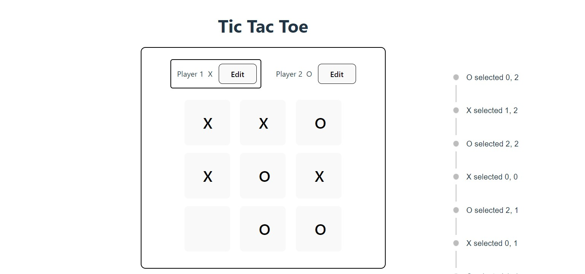
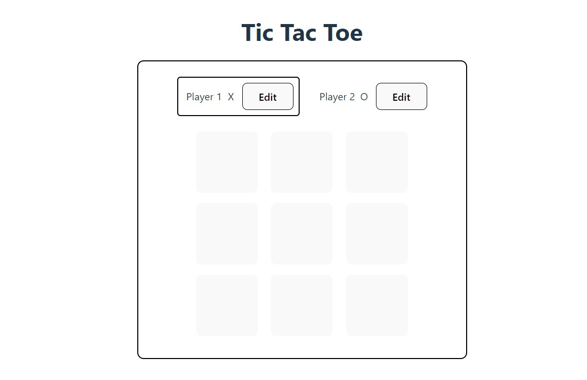

<!-- Header -->
<h1 align="center">
  Tic Tac Toe Game
</h1>

  Welcome to the interactive and fun Tic Tac Toe game! This game is implemented using React and Material-UI.

<!-- Video Screenshot with Link -->

  

## Features
- Play against a friend on the same device.
- Track the game history with a log of all moves.
- See the winner or a draw message when the game ends.
- Visually appealing design with Material-UI components.

## 🎮 How to Play
1. Clone this repository to your local machine.
2. Navigate to the project directory.
3. Install dependencies using `npm install` or `yarn install`.
4. Start the development server with `npm run dev` or `yarn dev`.
5. Open your browser and go to `http://localhost:5173` to play the game.

## ⭐️ Gameplay
- Players take turns clicking on the game board to place their "X" or "O" symbol.
- The first player to get three of their symbols in a row (horizontally, vertically, or diagonally) wins.
- If all squares are filled without a winner, the game is a draw.

## 🚀 Development
- This project is built with React and Material-UI.
- The game logic is implemented to determine the winner and track game history.
- Custom components are used for the game board, player cards, and game log.

## 📁 Folder Structure
- `src/components`: Contains React components for different parts of the game.
- `src/winning-combination.js`: Defines the winning combinations for the game.
- `src/App.js`: Main component where the game logic is implemented.
- `public`: Contains static assets such as images and favicon.

## 📷 Screenshots

  
  

## 🎨 Credits
- Vite for fast development: [vitejs.dev](https://vitejs.dev/)
- Built with React: [reactjs.org](https://reactjs.org/)
- Material-UI for styling and components: [mui.com](https://mui.com/)

---

  Feel free to contribute, report issues, or suggest enhancements! 🚀

